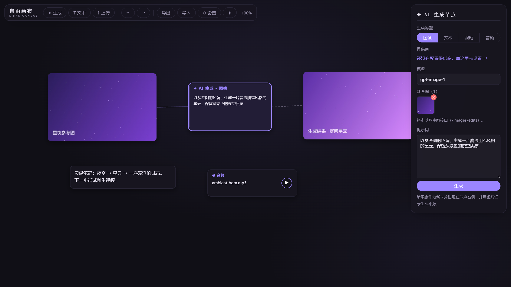
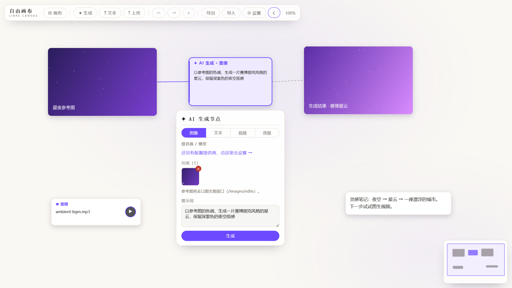

# LibreCanvas 自由画布

**开源、免费、BYOK 的 AI 创作画布。自己的 key，自己的画布。**

AI 画布平台一个接一个涨价、锁功能、圈订阅。LibreCanvas 反着来：

- **真开源**：MIT 许可证，没有"公开但不许改"，没有商业授权二重门。随便 fork，随便自部署，随便商用。
- **BYOK（Bring Your Own Key）**：你自己去模型提供商充值买 API，key 只存在你本机浏览器的 localStorage 里，调用时浏览器直连提供商接口——本项目没有服务器，也永远见不到你的 key。
- **多模型**：任何 OpenAI 兼容接口都能接（OpenAI、DeepSeek、硅基流动、智谱、各类中转站……），文生图、文生文自由切换。
- **零成本部署**：纯静态站点，GitHub Pages / 任何静态托管 / 本地打开都能跑。

## 功能（v1.0）

- 无限画布：滚轮缩放、空格+拖拽平移、左键框选、Shift 多选、整体拖动、Ctrl+G 编组、Ctrl+Z 撤销重做
- 多画布项目：工具栏「▤ 画布」新建/切换/重命名/删除，每块画布独立保存、切换自动落盘
- `@` 引用：生成节点提示词里敲 `@` 弹出卡片菜单——文本卡并入提示词作引用资料，图片卡直接成为参考图
- 昼/夜双皮肤：与主站同源的设计 token，画布内卡片与连线同步换色，偏好本地记忆
- 五类卡片：图片、视频（画布内播放）、音频（播放键）、文本（双击编辑）、AI 生成节点（双击画布创建）
- 四种生成：文生图（/images/generations）、文生文（/chat/completions）、文生视频（/videos 异步任务流，自动轮询进度）、文本转语音（/audio/speech，可选音色）
- 全类型上传：图片 / 视频 / 音频 / 文本（.txt/.md），工具栏「上传」或直接拖入画布，坏文件超时跳过不阻塞
- **图片参考输入**：悬停图片卡从右侧锚点拖线连到生成节点即成参考（紫色实线）。图像模式自动走以图生图（/images/edits，支持多图）；文本模式把图片作为视觉输入发给多模态模型；面板内缩略图可单个移除
- **蒙版局部重绘（inpainting）**：选中图片 → 「局部重绘」→ 画笔涂抹目标区域（可调笔刷/擦除/清空）→ 提示词生成。走 /images/edits 的 image+mask 规范（涂抹区 alpha 精确归零），结果落新卡带血缘线
- 生成血缘：生成结果作为新卡片出现在节点右侧，虚线记录来源
- 画布自动保存到浏览器 IndexedDB（大媒体也装得下），支持导出/导入 JSON
- 提供商管理：多提供商、常用模型下拉、连接测试、内置常见预设

## 在线使用

官方部署：<https://canvas.tiaozhuxiansheng.com>（纯静态，你的 key 只存你自己的浏览器）

## 界面

设计语言与 [蛛网之上](https://tiaozhuxiansheng.com) 同源：暖白纸面 / 夜幕双皮肤，蛛丝紫点睛，一键切换。

**夜屏（默认）** —— 参考图连线 → 生成节点 → 结果落卡，虚线记录生成血缘：



**昼屏** —— 同一块画布，暖白纸面：



## 快速开始

```bash
npm install
npm run dev
```

打开 http://localhost:5173 → 右上角「⚙ 设置」→ 添加提供商（填 Base URL 和 API Key）→ 双击画布创建生成节点 → 填提示词 → 生成。

### 操作速查

| 操作 | 说明 |
| --- | --- |
| 双击画布 | 创建 AI 生成节点 |
| 左键拖拽（空白处） | 框选 |
| 空格 + 拖拽 / 滚轮 | 平移 / 缩放 |
| Shift + 点选 | 加选 / 减选 |
| 拖动选中节点 | 多选整体移动 |
| Ctrl+G / Ctrl+Shift+G | 编组 / 解组（点任一成员即全组选中） |
| Ctrl+A / Esc / Delete | 全选 / 取消选择 / 删除 |
| Ctrl+Z / Ctrl+Shift+Z | 撤销 / 重做 |
| 卡片右侧圆点拖线 | 连到生成节点作参考 |
| 提示词内输入 `@` | 引用画布上的图片 / 文本卡片 |

## 已知边界

- 浏览器直连要求提供商接口支持 CORS。主流官方 API 和多数中转站都支持；个别不支持的提供商，后续会提供一个可选的本地代理方案。
- 视频生成接口以 OpenAI `/videos` 异步任务流为准；返回 `data[0].url / b64_json` 的同步风格也兼容。其它私有协议的提供商暂不支持。
- 单个上传文件上限 100MB。

## 路线图

- [ ] 参考图用于视频生成（Sora input_reference 等）
- [ ] 非 OpenAI 兼容接口的原生适配（Anthropic、火山方舟等）
- [ ] 可选本地代理（解决个别提供商 CORS 限制）
- [ ] 对齐吸附、画布小地图

## 许可证

[MIT](./LICENSE) —— 用、改、卖，都行。唯一的请求：保持开源精神，别把它变成下一个收费围城。
